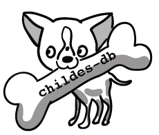
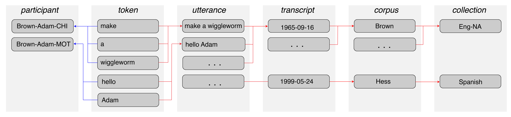

```{r setup, include=FALSE}
library(glue)
library(tidyverse)
library(ggthemes)

knitr::opts_chunk$set(echo = TRUE, cache = TRUE, warning = FALSE,
                      message = FALSE, rows.print = 20)
options(DT.options = list(searching = FALSE, lengthChange = FALSE))

.font <- "Source Sans Pro"
theme_set(langcog::theme_mikabr(base_family = .font))
theme_update(plot.margin = margin(0, 0, 2, 0, "pt"),
             legend.margin = margin(0, 0, 0, 0, "pt"))

source("reveal.R")
```


## wordbankr

<div class="centered">
<br>

</div>

## wordbankr {.build}
```{r wb_a}
library(wordbankr)
```
```{r wb_b}
help(package = "wordbankr")
```
```{r wb_c}
ls("package:wordbankr")
```

## wordbankr: instruments
```{r wb_inst}
get_instruments()
```

## wordbankr: sources
```{r wb_src_a}
get_sources()
```

## wordbankr: sources
```{r wb_src_b}
get_sources(language = "English (American)")
```

## wordbankr: administrations
```{r wb_admin_a, rows.print=15}
admins_eng_ws <- get_administration_data(language = "English (American)", form = "WS")
admins_eng_ws
```
```{r wb_admin_b}
n_distinct(admins_eng_ws$data_id)
```

## wordbankr: administrations
```{r wb_admin_c}
admins_eng_ws %>% count(age)
```

## wordbankr: administrations
```{r wb_admin_d}
ggplot(admins_eng_ws, aes(x = age, y = production)) +
  geom_jitter(colour = "grey", size = 0.5) +
  geom_smooth() +
  labs(x = "Age (months)", y = "Productive vocabulary size")
```

## wordbankr: administrations
```{r wb_admin_e}
admins_russian <- get_administration_data(language = "Russian")
admins_russian
```

## wordbankr: administrations
```{r wb_admin_f}
admins_ws <- get_administration_data(form = "WS")
admins_ws
```

## wordbankr: administrations
```{r wb_admin_g, rows.print=15}
admins <- get_administration_data()
admins
nrow(admins)
```

## wordbankr: administrations
```{r wb_admin_h, rows.print=15}
admins %>% count(language, form)
```

## wordbankr: items
```{r wb_item_a}
items_eng_ws <- get_item_data(language = "English (American)", form = "WS")
items_eng_ws
```

## wordbankr: items
```{r wb_item_b}
items_eng_ws %>% distinct(type)
```

## wordbankr: items
```{r wb_item_c, rows.print=25}
items_eng_ws %>% distinct(category)
```

## wordbankr: items
```{r wb_item_d}
items_eng_ws %>% distinct(lexical_category)
```

## wordbankr: items
```{r wb_item_e}
items <- get_item_data()
items
```

## wordbankr: items
```{r wb_item_f}
items %>% count(language, form)
```

## wordbankr: data
```{r wb_data_a1}
ids <- items_eng_ws %>%
  filter(definition %in% c("dog", "cat")) %>%
  pull(item_id)
```
```{r wb_data_a2}
get_instrument_data(language = "English (American)", form = "WS", items = ids)
```

## wordbankr: data
```{r wb_data_b}
get_instrument_data(language = "English (American)", form = "WS",
                    items = ids, administrations = TRUE, iteminfo = TRUE)
```

## wordbankr: data
```{r wb_data_c1, rows.print=15}
twos <- admins_eng_ws %>% filter(age == 24)
dog_cat <- items_eng_ws %>% filter(definition %in% c("dog", "cat"))
```
```{r wb_data_c2}
get_instrument_data(language = "English (American)", form = "WS", items = dog_cat$item_id,
                    administrations = twos, iteminfo = dog_cat)
```

## wordbankr

__Exercises__

1. Compute and plot median productive vocabulary size (as proportion of total words) over age in each language. Limit to WS data for children 16-30 months old (hint: `left_join` and `facet_wrap` are likely to be helpful).

2. For English WS data, compute and plot the proportion of children that produce each word in the "toys" category at each age.

3. (_Bonus_: Do the same thing as in 2 but separately for girls and boys.)

---
  
```{r wb_ex1_a, echo=FALSE, include=FALSE}
items %>%
  filter(form == "WS", type == "word") %>%
  group_by(language) %>%
  summarise(words = n()) ->
  num_words

admins %>%
  filter(form == "WS", age >= 16, age <= 30) %>%
  left_join(num_words) %>%
  mutate(prop_vocab = production / words) %>%
  group_by(language, age) %>%
  summarise(median_vocab = median(prop_vocab)) ->
  vocab_summary
```

`r apply_reveal("wb_ex1_a", "rows.print=5", "__Exercise 1__")`

---
  
```{r wb_ex1_b, eval=FALSE, echo=FALSE, include=FALSE}
ggplot(vocab_summary, aes(x = age, y = median_vocab)) +
  facet_wrap(~language, ncol = 7) +
  geom_point(size = 0.6) +
  ylim(0, 1) +
  labs(x = "Age (months)", y = "Productive vocabulary size") +
  theme(strip.text = element_text(size = rel(0.5)))
```

`r apply_reveal("wb_ex1_b", "fig.height=4.5, fig.width=8", "__Exercise 1__")`

--- {.build}

__Exercise 2__

```{r wb_ex2_a}
toys <- items_eng_ws %>%
  filter(type == "word", category == "toys")
```

```{r wb_ex2_b}
toys_data <- get_instrument_data(language = "English (American)", form = "WS",
                                 items = toys$item_id,
                                 administrations = admins_eng_ws,
                                 iteminfo = toys) %>%
  mutate(produces = !is.na(value) & value == "produces")
```

---

```{r wb_e2a, echo=FALSE, include=FALSE}
toys_data %>%
  group_by(definition, age) %>%
  summarise(prop_produces = sum(produces) / n()) ->
  toys_summary
```

`r apply_reveal("wb_e2a", "rows.print=15", "__Exercise 2__")`

---

```{r wb_e2b, eval=FALSE, echo=FALSE, include=FALSE}
ggplot(toys_summary, aes(x = age, y = prop_produces)) +
  facet_wrap(~definition, ncol = 6) +
  geom_smooth() +
  labs(x = "Age (months)", y = "Proportion of children producing")
```

`r apply_reveal("wb_e2b", "fig.height=4.5, fig.width=8", "__Exercise 2__")`

---

```{r wb_e3a, echo=FALSE, include=FALSE}
toys_data %>%
  filter(!is.na(sex)) %>%
  group_by(definition, age, sex) %>%
  summarise(prop_produces = sum(produces) / n()) ->
  toys_summary_sex
```

`r apply_reveal("wb_e3a", "rows.print=15", "__Exercise 3__")`

---

```{r wb_e3b, eval=FALSE, echo=FALSE, include=FALSE}
ggplot(toys_summary_sex, aes(x = age, y = prop_produces)) +
  facet_wrap(~definition, ncol = 6) +
  geom_smooth(aes(colour = sex), se = FALSE) +
  scale_colour_ptol(name = "") +
  labs(x = "Age (months)", y = "Proportion of children producing")
```

`r apply_reveal("wb_e3b", "fig.height=4, fig.width=8", "__Exercise 3__")`

## wordbankr: AoA
```{r, echo=FALSE}
demo_words <- c("balloon", "puzzle")
demo_aoa <- fit_aoa(toys_data) %>% filter(definition %in% demo_words)

demo_summary <- toys_data %>%
  filter(definition %in% demo_words) %>%
  group_by(definition, age) %>%
  summarise(total = n(),
            prop_produces = sum(produces) / total)

aoa_plot <- ggplot(demo_summary,
                   aes(x = age, y = prop_produces, colour = definition)) +
  facet_wrap(~definition) +
  geom_point() +
  scale_colour_ptol(guide = FALSE) +
  labs(x = "Age (months)", y = "Proportion of children producing")
aoa_plot
```

## wordbankr: AoA
```{r, echo=FALSE}
aoa_plot <- aoa_plot +
  geom_smooth(aes(weight = total), method = "glm", se = FALSE,
              method.args = list(family = "binomial"))
aoa_plot
```

## wordbankr: AoA
```{r, echo=FALSE}
aoa_plot +
  geom_hline(yintercept = 0.5, colour = "slategrey") +
  geom_vline(aes(xintercept = aoa), colour = "slategrey", data = demo_aoa)
```

## wordbankr: AoA
```{r, rows.print=5}
fit_aoa(toys_data) %>% select(definition, aoa)
```
```{r, rows.print=5}
fit_aoa(toys_data, method = "glmrob", proportion = 0.8) %>% select(definition, aoa)
```

## wordbankr: unilemmas
```{r, rows.print=5}
get_crossling_items()
```
```{r, rows.print=10}
get_crossling_data(uni_lemmas = "dog")
```


## childesr {.flexbox .vcenter}

<div class="centered">
  
  
</div>

## childesr {.build}

```{r cdb_a}
library(childesr)
```
```{r cdb_b}
help(package = "childesr")
```
```{r cdb_c}
ls("package:childesr")
```

## childesr: collections, corpora

```{r cdb_co_a, rows.print=7}
get_collections()
```

```{r cdb_co_b, rows.print=7}
get_corpora()
```

## childesr: transcripts

```{r cdb_tra_a, rows.print=7}
get_transcripts(collection = "Eng-NA")
```

```{r cdb_tra_b, rows.print=7}
get_transcripts(corpus = c("Brown", "Clark"))
```

## childesr: participants

```{r cdb_par_a, rows.print=7}
get_participants(corpus = "Clark")
```

```{r cdb_par_b, rows.print=7}
get_participants(collection = "Eng-NA", age = c(24, 36))
```

## childesr: utterances

```{r cdb_utt_a, rows.print=7}
get_utterances(corpus = "Clark", role = "target_child")
```

```{r cdb_utt_b, rows.print=7}
get_utterances(corpus = "Clark", role_exclude = "target_child")
```

## childesr: types

```{r cdb_typ_a, rows.print=7}
get_types(corpus = "Clark", type = "dog")
```

```{r cdb_typ_b, rows.print=7}
get_types(collection = "Eng-NA", role = "target_child", type = "dog")
```

## childesr: tokens

```{r cdb_tok_a, rows.print=7}
get_tokens(corpus = "Clark", role = "target_child", token = "dog")
```

```{r cdb_tok_b, rows.print=7}
get_tokens(corpus = "Clark", role = "target_child", token = "dog", replace = FALSE)
```

## childesr: tokens

```{r cdb_tok_c, rows.print=7}
get_tokens(corpus = "Clark", role = "target_child", token = c("dog", "cat"))
```

```{r cdb_tok_d, rows.print=7}
get_tokens(corpus = "Clark", role = "target_child", token = "dog%")
```

## childesr: tokens

```{r, cdb_tok_e, rows.print=7}
get_tokens(corpus = "Clark", role = "target_child", token = "*", stem = "run")
```

```{r cdb_tok_f, rows.print=7}
get_tokens(corpus = "Clark", role = "target_child", token = "*", part_of_speech = "v")
```

## childesr: speaker statistics

```{r cdb_ss_a}
brown_stats <- get_speaker_statistics(corpus = "Brown", role = "target_child")
brown_stats
```

## childesr: speaker statistics

```{r cdb_ss_b, fig.height=4, fig.width=6}
ggplot(brown_stats, aes(x = target_child_age, y = mlu_w, colour = target_child_name)) +
  geom_point() +
  geom_smooth(method = "lm", se = FALSE) +
  scale_colour_ptol(name = "")
```

## childesr

__Exercises__

1. For each corpus, compute the number of transcripts in it. Make a histogram of these counts.

2. For each corpus, compute the mean length of its transcripts in number of tokens spoken by everyone other than the target child. Plot these means againt the number of transcripts from 1.

3. Retrieve and plot the number of times each child in the Brown corpus said each inflection of the verb "go" over age.

---

__Exercise 1__

```{r cdb_ex1}
transcripts <- get_transcripts()
```

---

```{r cdb_ex1_a, echo=FALSE, include=FALSE}
transcripts %>%
  group_by(corpus_id, corpus_name, language) %>%
  summarise(num_transcripts = n()) ->
  corpus_transcripts
```

`r apply_reveal("cdb_ex1_a", pre_text = "__Exercise 1__")`

---

```{r cdb_ex1_b, eval=FALSE, echo=FALSE, include=FALSE}
ggplot(corpus_transcripts, aes(x = num_transcripts)) +
  geom_histogram() +
  labs(x = "Number of transcripts in corpus", y = "Count of corpora")
```

`r apply_reveal("cdb_ex1_b", "fig.height=4, fig.width=6", "__Exercise 1__")`

---

__Exercise 2__

```{r cdb_ex2}
speaker_stats <- get_speaker_statistics(role_exclude = "target_child")
```

---

```{r cdb_ex2_a, echo=FALSE, include=FALSE}
speaker_stats %>%
  group_by(corpus_id) %>%
  summarise(mean_tokens = mean(num_tokens)) %>%
  left_join(corpus_transcripts) ->
  corpus_tokens
```

`r apply_reveal("cdb_ex2_a", pre_text = "__Exercise 2__")`

---

```{r cdb_ex2_b, eval=FALSE, echo=FALSE, include=FALSE}
ggplot(corpus_tokens, aes(x = num_transcripts, y = mean_tokens)) +
  geom_point() +
  labs(x = "Number of transcripts in corpus", y = "Mean transcript length")
```

`r apply_reveal("cdb_ex2_b", "fig.height=4, fig.width=6", "__Exercise 2__")`

---

__Exercise 3__

```{r cdb_ex3}
go_tokens <- get_tokens(corpus = "Brown", role = "target_child",
                        stem = "go", token = "*", replace = FALSE)
```

---

```{r cdb_ex3_a, echo=FALSE, include=FALSE}
go_tokens %>%
  group_by(target_child_name) %>%
  mutate(age = floor(target_child_age)) %>%
  group_by(target_child_name, age, gloss) %>%
  summarise(num_tokens = n()) ->
  go_summary
```

`r apply_reveal("cdb_ex3_a", pre_text = "__Exercise 3__")`

---

```{r cdb_ex3_b, eval=FALSE, echo=FALSE, include=FALSE}
ggplot(go_summary, aes(x = age, y = num_tokens, colour = gloss)) +
  facet_wrap(~target_child_name, scales = "free") +
  theme(legend.position = "top") +
  geom_line() +
  scale_colour_ptol(name = "") +
  labs(x = "Age (months)", y = "Number of tokens spoken by child")
```

`r apply_reveal("cdb_ex3_b", "fig.height=4, fig.width=8", "__Exercise 3__")`


## Mini-project! {.build}

Use data from Wordbank/childes-db to explore a question about language learning. Some ideas:

__Wordbank__

- Explore the relationship between vocabulary size and grammar ability ("complexity" items).
- Look at the composition of vocabulary -- what proportion of words that children know are which lexical category -- and how it changes over age.

__childes-db__

- Characterize the developmental trajectory of children's lexical diversity (e.g. MTLD) and how it differs by gender.
- Estimate the frequencies of color terms (or some other interesting set of words) in speech to children over age.

__Both__

- For some set of words, estimate their age of acquisition from Wordbank and frequency in child-directed speech from childes-db and examine the relationship between them.
- Determine which words are earliest-learned according to CDI data and according to corpus data and compare the two.


## Resources

__Wordbank__<br>
  – [wordbank.stanford.edu](http://wordbank.stanford.edu)<br>
  – [github.com/langcog/wordbankr](https://github.com/langcog/wordbankr)<br>
  – [langcog.github.io/wordbankr](http://langcog.github.io/wordbankr)<br>
  – [mb-cdi.stanford.edu](http://mb-cdi.stanford.edu)<br>
  <span class="small">
  Citation: Frank, M. C., Braginsky, M., Yurovsky, D., & Marchman, V. A. (2017). Wordbank: An open repository for developmental vocabulary data. Journal of Child Language, 44(3), 677-694.
</span>

  __childes-db__<br>
  – [childes-db.stanford.edu/](http://childes-db.stanford.edu)<br>
  – [github.com/langcog/childesr](https://github.com/langcog/childesr)<br>
  – [childes.talkbank.org](https://childes.talkbank.org)<br>
  <span class="small">Citation: Sanchez, A., Meylan, S. C., Braginsky, M., MacDonald, K. E., Yurovsky, D., & Frank, M. C. (2019). childes-db: A flexible and reproducible interface to the Child Language Data Exchange System. Behavior Research Methods, 1-14.</span>

  __This presentation__<br>
  – [github.com/mikabr/acq-tools](https://github.com/mikabr/acq-tools)<br>
  – [mikabr.github.io/acq-tools](https://mikabr.github.io/acq-tools)

__Contact__: [mikabr@mit.edu](mailto:mikabr@mit.edu), [mcfrank@stanford.edu](mailto:mcfrank@stanford.edu)
