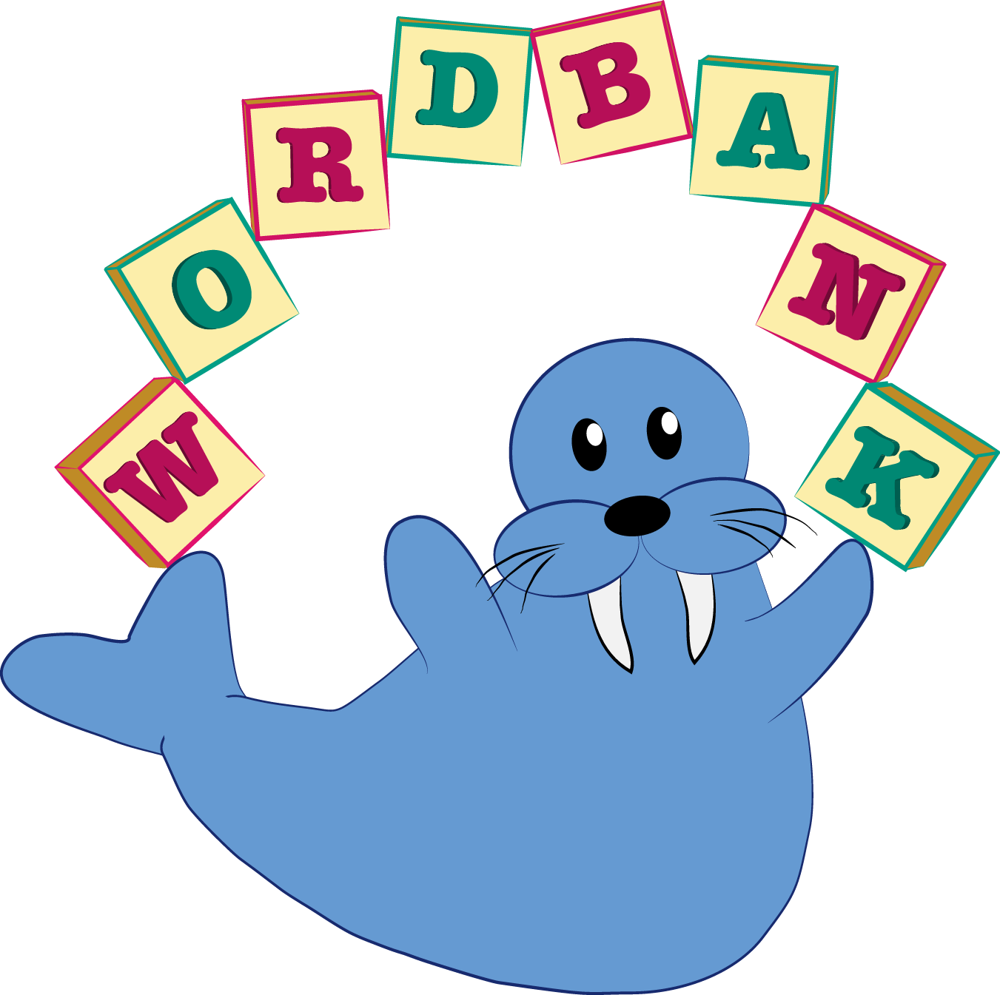

```{r setup, include=FALSE}
library(glue)
library(tidyverse)
library(ggthemes)

knitr::opts_chunk$set(echo = TRUE, cache = TRUE, warning = FALSE,
                      message = FALSE, rows.print = 20)
options(DT.options = list(searching = FALSE, lengthChange = FALSE))

.font <- "Source Sans Pro"
theme_set(langcog::theme_mikabr(base_family = .font))
theme_update(plot.margin = margin(0, 0, 2, 0, "pt"),
             legend.margin = margin(0, 0, 0, 0, "pt"))
```


## wordbankr

<div class="centered">
<br>

</div>

## wordbankr {.build}
```{r}
library(wordbankr)
ls("package:wordbankr")
```

## wordbankr: instruments
```{r}
intruments <- get_instruments()
intruments
```

## wordbankr: sources
```{r}
sources <- get_sources()
sources
```

## wordbankr: sources
```{r}
get_sources(language = "English (American)")
```

## wordbankr: administrations
```{r, rows.print=15}
admins_eng_ws <- get_administration_data(language = "English (American)", form = "WS")
admins_eng_ws
n_distinct(admins_eng_ws$data_id)
```

## wordbankr: administrations
```{r}
admins_eng_ws %>% count(age)
```

## wordbankr: administrations
```{r}
ggplot(admins_eng_ws, aes(x = age, y = production)) +
  geom_jitter(colour = "grey", size = 0.5) +
  geom_smooth()
```

## wordbankr: administrations
```{r}
admins_russian <- get_administration_data(language = "Russian")
admins_russian
```

## wordbankr: administrations
```{r}
admins_ws <- get_administration_data(form = "WS")
admins_ws
```

## wordbankr: administrations
```{r, rows.print=15}
admins <- get_administration_data()
admins
nrow(admins)
```

## wordbankr: administrations
```{r, rows.print=15}
admins %>% count(language, form)
```

## wordbankr: items
```{r}
items_eng_ws <- get_item_data(language = "English (American)", form = "WS")
items_eng_ws
```

## wordbankr: items
```{r}
items_eng_ws %>% distinct(type)
```

## wordbankr: items
```{r, rows.print=25}
items_eng_ws %>% distinct(category)
```

## wordbankr: items
```{r}
items_eng_ws %>% distinct(lexical_category)
```

## wordbankr: items
```{r}
items <- get_item_data()
items
```

## wordbankr: items
```{r}
items %>% count(language, form)
```

## wordbankr: data
```{r, rows.print=15}
ids <- items_eng_ws %>%
  filter(definition %in% c("dog", "cat")) %>%
  pull(item_id)

get_instrument_data(language = "English (American)", form = "WS", items = ids)
```

## wordbankr: data
```{r}
get_instrument_data(language = "English (American)", form = "WS",
                    items = ids, administrations = TRUE, iteminfo = TRUE)
```

## wordbankr: data
```{r}
twos <- admins_eng_ws %>% filter(age == 24)
dog_cat <- items_eng_ws %>% filter(definition %in% c("dog", "cat"))
get_instrument_data(language = "English (American)", form = "WS", items = ids,
                    administrations = twos, iteminfo = dog_cat)
```

## wordbankr

__Exercises__

1. Compute and plot median productive vocabulary size (as proportion of total words) over age in each language. Limit to WS data for children 16-30 months old.

2. For English WS data, compute and plot the proportion of children that produce each word in the "toys" category at each age. Now do the same thing but separately for girls and boys.

## wordbankr {.build}

Median vocabulary sizes

```{r}
num_words <- items %>%
  filter(form == "WS", type == "word") %>%
  group_by(language) %>%
  summarise(words = n())
```

```{r}
vocab_summary <- admins %>%
  filter(form == "WS", age >= 16, age <= 30) %>%
  left_join(num_words) %>%
  mutate(prop_vocab = production / words) %>%
  group_by(language, age) %>%
  summarise(median_vocab = median(prop_vocab))
```

```{r, eval=FALSE}
ggplot(vocab_summary, aes(x = age, y = median_vocab)) +
  facet_wrap(~language) +
  geom_point() +
  ylim(0, 1) +
  labs(x = "Age (months)", y = "Productive vocabulary size")
```

---

```{r, echo=FALSE, fig.height=6, fig.width=8}
ggplot(vocab_summary, aes(x = age, y = median_vocab)) +
  facet_wrap(~language) +
  geom_point() +
  ylim(0, 1) +
  labs(x = "Age (months)", y = "Productive vocabulary size") +
  theme(strip.text = element_text(size = rel(0.6)))
```

## wordbankr {.build}

Toy trajectories

```{r}
toys <- items_eng_ws %>%
  filter(type == "word", category == "toys")

toys_data <- get_instrument_data(language = "English (American)", form = "WS",
                                 items = toys$item_id,
                                 administrations = admins_eng_ws,
                                 iteminfo = toys) %>%
  mutate(produces = !is.na(value) & value == "produces")
```

```{r}
toys_summary <- toys_data  %>%
  group_by(definition, age) %>%
  summarise(total = n(),
            prop_produces = sum(produces) / total)
```

```{r, eval=FALSE}
ggplot(toys_summary, aes(x = age, y = prop_produces)) +
  facet_wrap(~definition) +
  geom_smooth(aes(weight = total), method = "glm", se = FALSE,
              method.args = list(family = "binomial")) +
  labs(x = "Age (months)", y = "Proportion of children producing")
```

---

```{r, echo=FALSE, fig.height=6, fig.width=8}
ggplot(toys_summary, aes(x = age, y = prop_produces)) +
  facet_wrap(~definition) +
  geom_smooth(aes(weight = total), method = "glm", se = FALSE,
              method.args = list(family = "binomial")) +
  labs(x = "Age (months)", y = "Proportion of children producing")
```

## wordbankr

Toy trajectories by sex

```{r}
toys_summary_sex <- toys_data %>%
  filter(!is.na(sex)) %>%
  group_by(definition, age, sex) %>%
  summarise(total = n(),
            prop_produces = sum(produces) / total)
```

```{r, eval=FALSE}
ggplot(toys_summary_sex, aes(x = age, y = prop_produces, colour = sex)) +
  facet_wrap(~definition) +
  geom_smooth(aes(weight = total), method = "glm", se = FALSE,
              method.args = list(family = "binomial")) +
  scale_colour_ptol(name = "") +
  labs(x = "Age (months)", y = "Proportion of children producing") +
  theme(legend.position = "top")
```

---

```{r, echo=FALSE, fig.height=6, fig.width=8}
ggplot(toys_summary_sex, aes(x = age, y = prop_produces, colour = sex)) +
  facet_wrap(~definition) +
  geom_smooth(aes(weight = total), method = "glm", se = FALSE,
              method.args = list(family = "binomial")) +
  scale_colour_ptol(name = "") +
  labs(x = "Age (months)", y = "Proportion of children producing") +
  theme(legend.position = "top")
```

## wordbankr: AoA
```{r, echo=FALSE}
demo_words <- c("balloon", "puzzle")
demo_aoa <- fit_aoa(toys_data) %>% filter(definition %in% demo_words)

demo_summary <- toys_data %>%
  filter(definition %in% demo_words) %>%
  group_by(definition, age) %>%
  summarise(total = n(),
            prop_produces = sum(produces) / total)

aoa_plot <- ggplot(demo_summary,
                   aes(x = age, y = prop_produces, colour = definition)) +
  facet_wrap(~definition) +
  geom_point() +
  scale_colour_ptol(guide = FALSE) +
  labs(x = "Age (months)", y = "Proportion of children producing")
aoa_plot
```

## wordbankr: AoA
```{r, echo=FALSE}
aoa_plot <- aoa_plot +
  geom_smooth(aes(weight = total), method = "glm", se = FALSE,
              method.args = list(family = "binomial"))
aoa_plot
```

## wordbankr: AoA
```{r, echo=FALSE}
aoa_plot +
  geom_hline(yintercept = 0.5, colour = "slategrey") +
  geom_vline(aes(xintercept = aoa), colour = "slategrey", data = demo_aoa)
```

## wordbankr: AoA
```{r, rows.print=5}
fit_aoa(toys_data) %>% select(definition, aoa)
```
```{r, rows.print=5}
fit_aoa(toys_data, method = "glmrob", proportion = 0.8) %>% select(definition, aoa)
```

## wordbankr: unilemmas
```{r, rows.print=5}
get_crossling_items()
```
```{r, rows.print=10}
get_crossling_data(uni_lemmas = "dog")
```


## childesr {.flexbox .vcenter}

<div class="centered">


</div>

## childesr

```{r, echo=FALSE}
knitr::opts_chunk$set(rows.print = 7)
```

```{r}
library(childesr)
help(package = "childesr")
ls("package:childesr")
```

## childesr: collections, corpora

```{r, rows.print=7}
get_collections()
```

```{r, rows.print=7}
get_corpora()
```

## childesr: transcripts

```{r, rows.print=7}
get_transcripts(collection = "Eng-NA")
```

```{r, rows.print=7}
get_transcripts(corpus = c("Brown", "Clark"))
```

## childesr: participants

```{r, rows.print=7}
get_participants(corpus = "Clark")
```

```{r, rows.print=7}
get_participants(collection = "Eng-NA", age = c(24, 36))
```

## childesr: utterances

```{r, rows.print=7}
get_utterances(corpus = "Clark", role = "target_child")
```

```{r, rows.print=7}
get_utterances(corpus = "Clark", role_exclude = "target_child")
```

## childesr: types

```{r, rows.print=7}
get_types(corpus = "Clark", type = "dog")
```

```{r, rows.print=7}
get_types(collection = "Eng-NA", role = "target_child", type = "dog")
```

## childesr: tokens

```{r, rows.print=7}
get_tokens(corpus = "Clark", role = "target_child", token = "dog")
```

```{r, rows.print=7}
get_tokens(corpus = "Clark", role = "target_child", token = "dog", replace = FALSE)
```

## childesr: tokens

```{r, rows.print=7}
get_tokens(corpus = "Clark", role = "target_child", token = c("dog", "cat"))
```

```{r, rows.print=7}
get_tokens(corpus = "Clark", role = "target_child", token = "dog%")
```

## childesr: tokens

```{r, rows.print=7}
get_tokens(corpus = "Clark", role = "target_child", token = "*", stem = "run")
```

```{r, rows.print=7}
get_tokens(corpus = "Clark", role = "target_child", token = "*", part_of_speech = "v")
```

## childesr: speaker statistics

```{r}
brown_stats <- get_speaker_statistics(corpus = "Brown", role = "target_child")
brown_stats
```

## childesr: speaker statistics

```{r, fig.height=4, fig.width=6}
ggplot(brown_stats, aes(x = target_child_age, y = mlu_w, colour = target_child_name)) +
  geom_point() +
  geom_smooth(method = "lm", se = FALSE) +
  scale_colour_ptol(name = "")
```

## childesr

__Exercises__

1. For each corpus, plot the number of transcripts in it against its mean length in number of tokens spoken by everyone other than the target child.

2. Retrieve and plot the number of times each child in the Brown corpus said each inflection of the verb "go" over age.

## childesr {.build}

Transcript stats

```{r}
transcripts <- get_transcripts()
corpus_transcripts <- transcripts %>%
  group_by(corpus_id, corpus_name, language) %>%
  summarise(num_transcripts = n())
```

```{r}
speaker_stats <- get_speaker_statistics(role_exclude = "target_child")
corpus_tokens <- speaker_stats %>%
  group_by(corpus_id) %>%
  summarise(mean_tokens = mean(num_tokens)) %>%
  left_join(corpus_transcripts)
```

```{r, eval=FALSE}
ggplot(corpus_tokens, aes(x = num_transcripts, y = mean_tokens)) +
  geom_point()
```

## childesr

Transcript stats

```{r, echo=FALSE}
ggplot(corpus_tokens, aes(x = num_transcripts, y = mean_tokens)) +
  geom_point()
```

## childesr {.build}

Brown "go" frequencies

```{r}
go_tokens <- get_tokens(corpus = "Brown", role = "target_child",
                        stem = "go", token = "*")
```

```{r}
go_summary <- go_tokens %>%
  mutate(age = cut(target_child_age, 20)) %>%
  group_by(target_child_name, age, gloss) %>%
  summarise(num_tokens = n())
```

```{r, eval=FALSE}
ggplot(go_summary, aes(x = age, y = num_tokens, colour = gloss)) +
  facet_wrap(~target_child_name, scales = "free") +
  geom_line(aes(group = gloss)) +
  scale_colour_ptol()
```

## childesr

Brown "go" frequencies

```{r, echo=FALSE}
ggplot(go_summary, aes(x = age, y = num_tokens, colour = gloss)) +
  facet_wrap(~target_child_name, scales = "free") +
  geom_line(aes(group = gloss)) +
  scale_colour_ptol(name = "") +
  theme(axis.text.x = element_text(angle = 30, hjust = 1),
        legend.position = "top")
```


## Mini-project!

Use data from Wordbank and/or childes-db to explore some question about language learning. Here's a few ideas:

__Wordbank__<br>
– Explore the relationship between vocabulary size and grammar ability (the items of type complexity).<br>
– Look at the composition of vocabulary -- what proportion of words that children know are which lexical category -- and how it changes over age.

__childes-db__<br>
– Characterize the developmental trajectory of children's lexical diversity (e.g. MTLD) and how it differs by gender.<br>
– Estimate the frequencies of color terms (or some other interesting set of words) in speech to children over age.

__Both__<br>
– For some set of words, estimate their age of acquisition from Wordbank and frequency in child-directed speech from childes-db and examine the relationship between them.<br>
– Determine which words are earliest-learned according to CDI data and according to corpus data and compare the two.

## Resources

__Wordbank__<br>
– [wordbank.stanford.edu](http://wordbank.stanford.edu)<br>
– [github.com/langcog/wordbankr](https://github.com/langcog/wordbankr)<br>
– [langcog.github.io/wordbankr](http://langcog.github.io/wordbankr)<br>
– [mb-cdi.stanford.edu](http://mb-cdi.stanford.edu)<br>
<span class="small">
Citation: Frank, M. C., Braginsky, M., Yurovsky, D., & Marchman, V. A. (2017). Wordbank: An open repository for developmental vocabulary data. Journal of Child Language, 44(3), 677-694.
</span>

__childes-db__<br>
– [childes-db.stanford.edu/](http://childes-db.stanford.edu)<br>
– [github.com/langcog/childesr](https://github.com/langcog/childesr)<br>
– [childes.talkbank.org](https://childes.talkbank.org)<br>
<span class="small">Citation: Sanchez, A., Meylan, S. C., Braginsky, M., MacDonald, K. E., Yurovsky, D., & Frank, M. C. (2019). childes-db: A flexible and reproducible interface to the Child Language Data Exchange System. Behavior Research Methods, 1-14.</span>

__This presentation__<br>
– [github.com/mikabr/acq-tools](https://github.com/mikabr/acq-tools)<br>
– [mikabr.github.io/acq-tools](https://mikabr.github.io/acq-tools)

__Contact__: [mikabr@mit.edu](mailto:mikabr@mit.edu)
